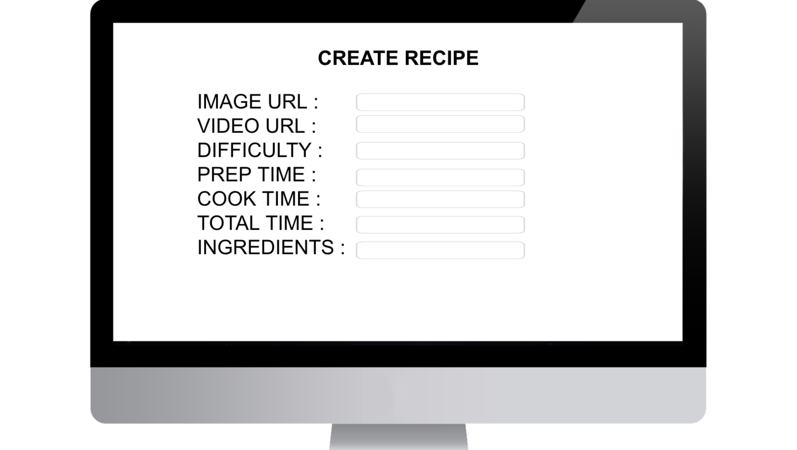
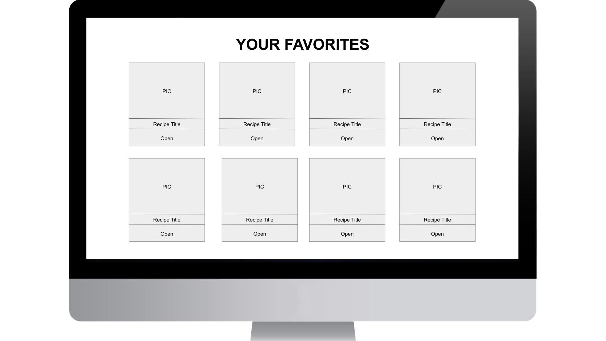

# Project 4
A Full Stack recipe discovery app

## Recipe Serendipity
Is a recipe app where users can search for recipes depending on what they have in their pantry. 

## MVP Goals
- User-authentication with JWT  
- Search Bar with functionality to search for recipes based on title/ingredients 
- Create, read, update, delete their own recipes.  
- Have a gallery page where we have searched items  
- Be able to click on a single recipe, displaying the items in the database for that specific recipe including the ingredients

## MVP Libraries

React 
React Router 
Rails 
RESTful API 
FontAwesome 
Semantic UI 

## MVP Client

### Wireframes
- Landing

- All Recipes

- Create Recipe

- One Recipe

- Favorites Page

## Component Breakdown
|  Component   |    Type    | state | props | Description                                                      |
| :----------: | :--------: | :---: | :---: | :--------------------------------------------------------------- |
|    Header    | functional |   n   |   n   | _The header will contain the navigation and logo._               |
|  Register  | functional |   n   |   n   | _The searchbar will let the user find recipes._       |
|  Login  | functional |   n   |   n   | _The searchbar will let the user find recipes._       |
|  Navigation  | functional |   n   |   n   | _The searchbar will let the user find recipes._       |
|   Recipe Gallery    |   class    |   y   |   n   | _The gallery will be the search results._      |
| Single Recipe | functional |   y   |   n   | _The user will open a single recipe to display values of that key._                 |
|  Create Recipe  | functional |   y  |   n   | _User will create a recipe._       |
|  Update Recipe  | functional |   y   |   n   | _User will update a recipe._       |
|  Highest Rated  | functional |   n   |   n   | _User will update a recipe._       |
|    Footer    | functional |   n   |   n   | _The footer will show info about me and a link to my portfolio._ |

## Component Estimates

| Task                | Priority | Estimated Time | Time Invested | Actual Time |
| ------------------- | :------: | :------------: | :-----------: | :---------: |
| Backend    |    H     |     15 hrs      |     2 hrs     |    TBD    |
| Add Login Form    |    H     |     4 hrs      |     TBD     |    TBD    |
| Create CRUD Actions |    H     |     10 hrs      |     1 hrs     |     TBD     |
| Add Navigation    |    H     |     4 hrs      |      TBD     |    TBD    |
| Gallery Page |    H     |     5 hrs      |     TBD     |     TBD     |
|  Single Post |    H     |     4 hrs      |     TBD     |     TBD     |
| TOTAL               |          |     42 hrs      |     3 hrs     |     TBD     |

## ERD Diagram

## Front-end Stretch Goals

- Have a page with the highest rated recipes.   
- Should I do step-by-step instructions
